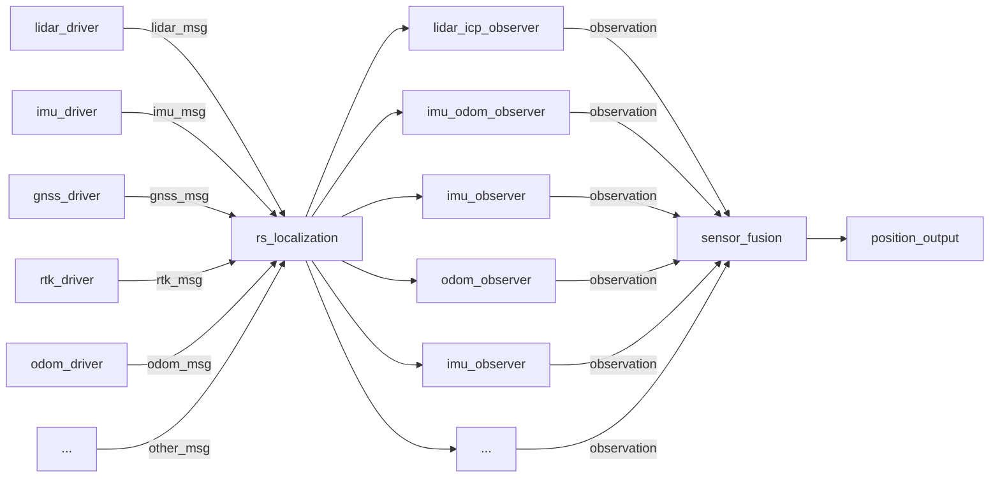

# **rs_localization**

## **1.System Block Diagram**

The following diagram shows the overall system structure. The system can be divided into 3 blocks:
- rs_localization
- observer
- sensor_fusion



### **1.1 rs_localization**
File : 
 - **rs_localization_ros_node.cpp** : A simple file for generating a ros node.

 - **rs_localization_ros.cpp** : Interface between ros and localization program.
   1. Receive sensor msg from ros and send to localization program.
   2. Receive localization result from localization result and publish as ros message

 - **rs_localization.cpp** : As the top level block of localization program, manage observer blocks and sensor fusion block.
    1. Perform initial pose estimation(this part is in rs_localization_ros.cpp now but should be moved here in the future.)
    2. Maintain observer and sensor_fusion objects

### **1.2 observer**
All observer inherited from observer_base.
The key function should be implemented for each observer:

-  **observerThread** : It is a background thread running inside each observer to handle time consuming tasks(e.g. perform icp). The new comming sensor msg is pushed into a message queue and the background thead will detect that and start processing them. The observation is then passed to sensor_fusion block.

- **getObservation** : The background thread calls this function to calculate observation.

- **applyEkfXXXX** and **observation.apply** : **observation.apply** is a lamda that runs **applyEkfXXXX** when it is called. So that the ekf prediction or update is implemented by each observer. This allows us to change observer used for the program without need to modify code outside the observer.

### **1.3 icp localization**
Icp localization is done in five steps:
1. point_filter: filters the input cloud.
2. sampler: Mutiple initial pose guesses can be generated from here. Since icp is very sensitive to initial guess. It might not be safe for only using one initial guess, esplically for initial pose estimation. 
3. pre_matcher: Some fast method could be implemented here to remove samples that is obviously impossible.
4. matcher: Perform icp for each pose guess.
v
### **1.3 sensor fusion**
It has the following 2 tasks:
1. Time sync: Some sensor msg might need a long time to be processed(e.g. lidar). This module makes sure all observation is pass to kalman filter in time order so that we have the best result. A observation queue and a state queue preseved by this block. If the new observation is a new one(i.e. it is newer than all observation in the queue). It is simply passed to kalman filter. If the new observation is old, then all states after the observation is removed and these obervation is reapplied one by one. 
2. Perform kalman filter update: The kalman filter update is done by calling **apply** in observation.

Block diagram:
```flow
st=>start: Start
e=>end
op_get_new_obs=>operation: Get new observation
cond_is_latest=>condition: Newest?

op_apply_ekf=>operation: Apply ekf
op_trim_state=>operation: Remove later states
op_reapply_observation=>operation: Reapply observation

st->op_get_new_obs->cond_is_latest
cond_is_latest(yes,right)->op_apply_ekf(right)->op_get_new_obs
cond_is_latest(no)->op_trim_state->op_reapply_observation(left)->op_get_new_obs
e->st
```